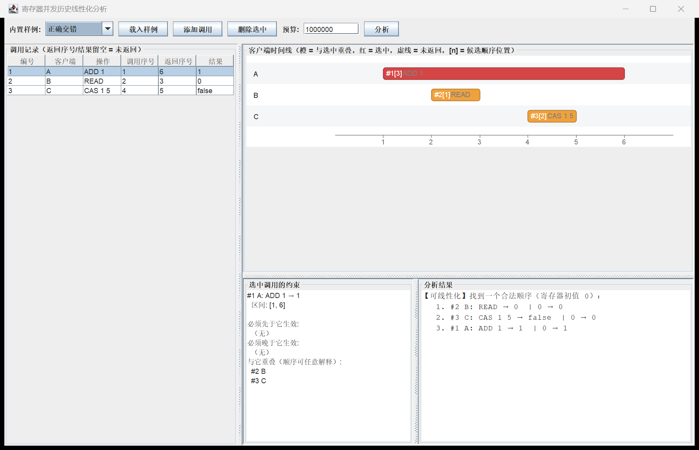
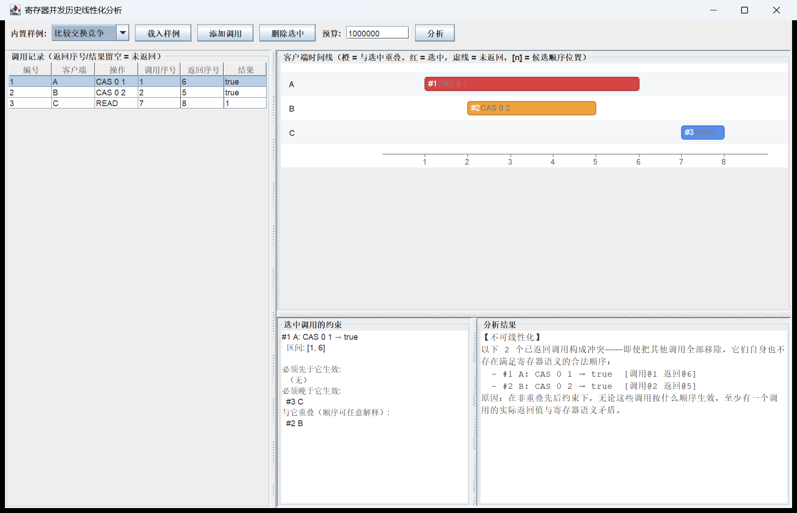

# 寄存器并发历史线性化分析工具

一个用于分析并发调用历史的桌面工具：判断一次真实调用历史能否解释为
符合顺序规范的**原子操作序列**（可线性化性，linearizability）。

分析对象是**初值为零的整数寄存器**，支持三种原子操作：

| 操作 | 文本形式 | 语义 | 返回 |
|------|----------|------|------|
| 读取 | `READ` | 返回当前值 | 整数 |
| 加并取新值 | `ADD <delta>` | 加上整数并返回新值 | 整数 |
| 比较并交换 | `CAS <expected> <new>` | 当前值等于期望值时写入新值 | 布尔 |

## 判定规则

- 每条调用记录包含：操作编号、客户端、操作、调用事件序号、返回事件序号、结果。
- **非重叠**调用之间的先后关系必须保留：若 a 的返回序号 < b 的调用序号，则 a 必须先于 b 生效。
- **重叠**调用允许按任意满足寄存器语义的顺序解释（不会只按开始时间或返回时间排序）。
- 没有返回的调用（返回序号与结果留空）可以被忽略，也可以在解释中补全；
  已返回的调用必须全部出现在解释中，不能丢弃。
- 重复编号、返回不晚于调用、返回类型错误、超过 16 条调用等属于**输入非法**，
  与一致性失败严格区分。
- 搜索预算可设置；预算耗尽返回**未判定**，绝不把未搜索完当作不存在解释。
- 同一输入与同一预算下结果完全确定（候选按操作编号升序尝试）。

## 构建与运行

需要 JDK 21+ 与 Maven 3.9+。

```powershell
mvn test       # 运行全部自动化测试
mvn package    # 打包为 target/app.jar
java -jar target/app.jar                  # 启动 Swing 界面
```

命令行模式（分析核心完全脱离界面运行）：

```powershell
java -jar target/app.jar --list                       # 列出内置样例
java -jar target/app.jar --sample 丢失更新             # 分析内置样例
java -jar target/app.jar --file examples\cas-race.txt # 分析文本格式历史
java -jar target/app.jar --budget 1000 --sample 丢失更新
```

> Windows 控制台若显示乱码，先执行 `chcp 65001`，
> 或加 JVM 参数 `-Dstdout.encoding=UTF-8`。

## 输入文本格式

每行一条调用，6 个以 `|` 分隔的字段；`#` 开头为注释；
返回序号与结果留空表示该调用没有返回：

```text
# 编号 | 客户端 | 操作 | 调用序号 | 返回序号 | 结果
1 | A | ADD 1 | 1 | 6 | 1
2 | B | READ | 2 | 3 | 0
3 | C | CAS 0 5 | 4 |   |
```

`examples/` 目录下有正确交错、丢失更新、比较交换竞争、未返回调用、
非法记录五个可直接用 `--file` 分析的样例。

## 界面

- 左侧：可编辑的调用记录表（可直接修改、添加、删除调用）。
- 右上：各客户端时间线。橙色 = 与选中调用重叠，红色 = 选中，
  虚线 = 未返回，`[n]` = 该调用在候选顺序中的位置。
- 左下：选中调用的约束（必须先于它 / 必须晚于它 / 与它重叠）。
- 右下：分析结果——可线性化时给出具体合法顺序与逐步寄存器值；
  不可线性化时给出冲突的已返回调用与原因（缩减后的反例，不保证最小）。




## 测试

`mvn test` 运行 44 个测试，覆盖：

- 正常顺序、重叠竞争、未返回调用（忽略与补全）、非法记录、预算耗尽；
- **独立核对**：测试内含一个与被测检查器不共享代码的暴力全排列实现，
  对 768 条穷举的两调用历史和 400 条随机小历史（1–7 调用，固定种子）
  逐条比对两种实现的结论，并验证见证序列的逐步一致性；
- 预算语义（未判定 ≠ 不可线性化、探索状态数不超过预算）；
- 结果可重复性；核心包不引用 AWT/Swing（可脱离界面运行）。

## 范围

仅做单对象、最多 16 个调用的分析，不扩展为通用验证平台。
运行时零第三方依赖；测试仅依赖 JUnit 5。
